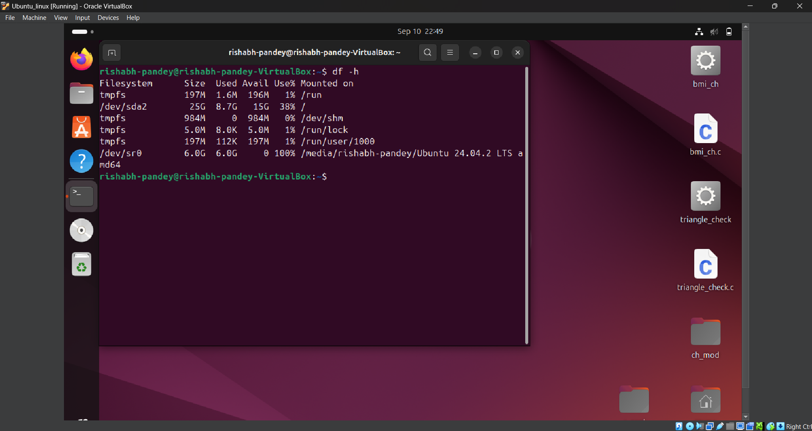

# LAB 0 — Linux Installation Report

*Course:* [Linux Lab]  

---

## 📑 Table of Contents
1. [Installation Method Chosen](#installation-method-chosen)
2. [Screenshots of Each Step](#screenshots-of-each-step)
   - [Setup](#setup)
   - [Installation](#installation)
   - [First Login](#first-login)
3. [Terminal Outputs](#terminal-outputs)
4. [Reflection](#reflection)
5. [Extra Questions](#extra-questions)

---

## 1. Installation Method Chosen
I chose to install Ubuntu using **[VirtualBox]**.  

**Reasoning:**  
- I chose virtual box because it is the safest, and comfortable option for a beginner at the computer handling and its inner mechanics. 

---

## 2. Screenshots of Each Step

### 🔧 Setup
  
*Created the VM / configured disk partitions before installation.*  

---

### 💽 Installation
  
*Ubuntu ISO booted successfully and installation completed.*  

---

### 👤 First Login
  
*Logged into Ubuntu for the first time with default user account.*  

---

### A short reflection: What challenges did I face during installation?

```

The process was rather simple in itself, and not so tiring 👌... but the most probable cause of stress in the whole process was minutes and minutes of loading screen of ubuntu.

```

### Extra Questions:

```

What are two advantages of installing Ubuntu in VirtualBox?

---

### **Advantages of Installing Ubuntu in VirtualBox**

1. **Safety and Flexibility** — You don’t risk messing with existing disk partitions or the main OS. If something goes wrong, you can just delete the VM and start fresh.
2. **Snapshots and Parallel Use** — VirtualBox allows you to take snapshots, roll back instantly, and run Ubuntu alongside Windows without rebooting.

---


What are two advantages of dual booting instead of using a VM?

### **Advantages of Dual Booting Instead of Using a VM**

1. **Full Hardware Performance** — Since Ubuntu runs directly on the machine, it uses 100% of CPU, GPU, and RAM, making it much faster than a VM (especially for resource-heavy tasks).
2. **Direct Hardware/Driver Access** — Dual boot avoids virtualization overhead and ensures proper support for drivers, graphics, and peripherals — ideal for gaming, graphics-intensive work, or networking.

---


```


