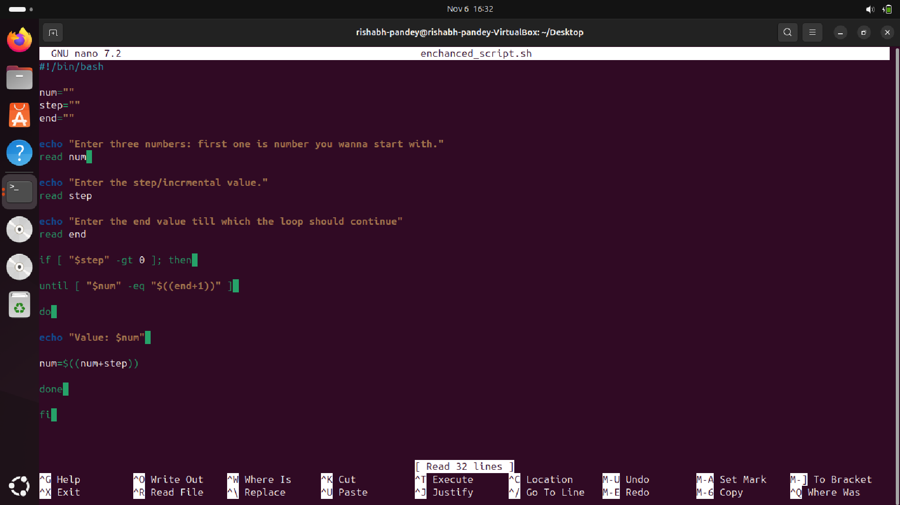

# Assignment 3 – Modify an Existing Script

## Objective

Enhance and customize an existing script by adding user input handling and validation.

## Tasks

1. Pick **one script** from the `Scripts/` directory (e.g., `print_numbers.sh`).
2. Modify it so that:

   * User provides **start**, **end**, and **step** values as input.
   * Script **validates inputs** (e.g., step must be positive).
3. Save the modified script as **`enhanced_numbers.sh`**.
4. Create **LAB3.md** explaining:

   * The **original behavior** of the script.
   * The **new enhanced behavior**.
   * Example runs with different inputs.

---

# LAB3

## Script Modified

**Original Script:** print_num.sh

**Enhanced Script:** `enhanced_numbers.sh`

---

## Original Behavior

The orignal script basically prints the number using For loop.

---

## New Enhanced Behavior

---

## Example Runs

#### In the following examples, I've taken two kinds of values with different start, end and step which defines the scalability of the code.

# Extra Questions

### 1. Difference between `$1`, `$@`, and `$#` in bash?

*The difference between these three is that... $1 is the first argument of the shell function. '$@' refers to all arguments, but individually so, and '$#' is number of all arguments in the shell function.*

### 2. What does `exit 1` mean in a script?

*'exit 1' in bash script means that there is an error.*

---
