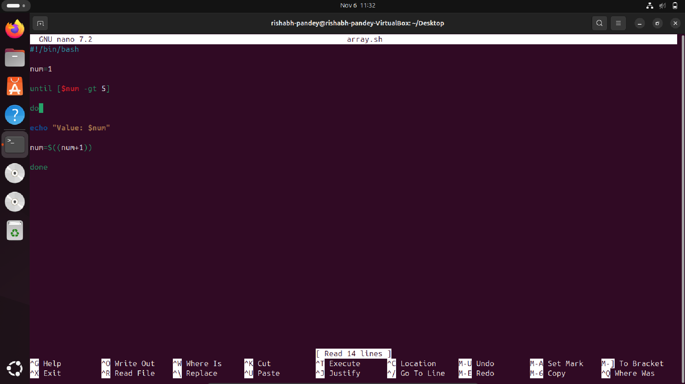
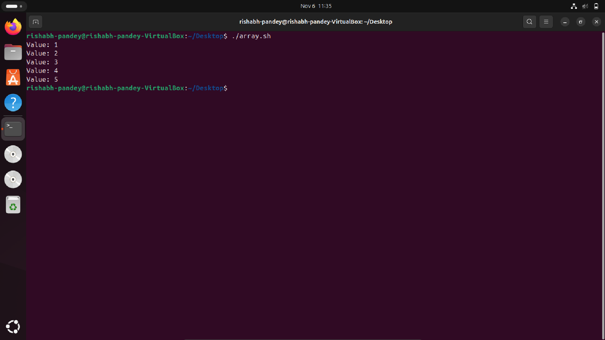

# Assignment 2 – Script Execution & Explanation

## Objective

Understand how existing scripts in the repository work by running and explaining them.

## Tasks

1. From `Scripts/`, choose **two simple scripts** (e.g., `print_numbers.sh`, `array_loop.sh`).
2. Run each script and observe the output.
3. Create **LAB2.md** containing:

   * Script name and purpose.
   * Line-by-line explanation of what it does.
   * Example run with input/output.

---

# LAB2

## Script 1

**Script Name:** Print numbers 

### Purpose

*It is supposed to print number in a range*

### Example Run

## Script 2

**Script Name** Array in shell 

### Purpose

*The script will print arrays until a certain condition*

### Example Run

# Questions

## What is the purpose of #!/bin/bash at the top of a script?

### Answer: It tells the OS which interpreter to even use while running the script.

## How do you make a script executable?

### Answer: To make the script executable, we just have to run "chmod +x 'filename' in the terminal."

