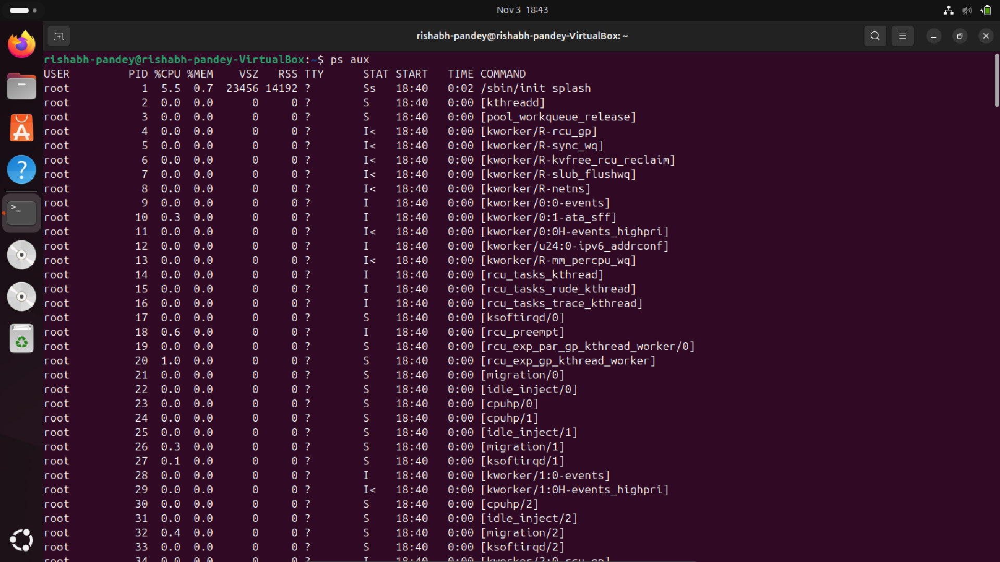
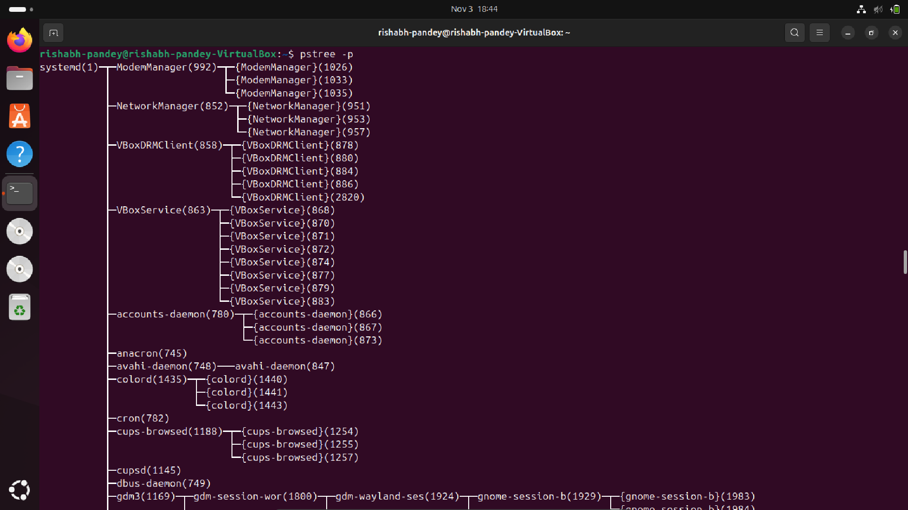
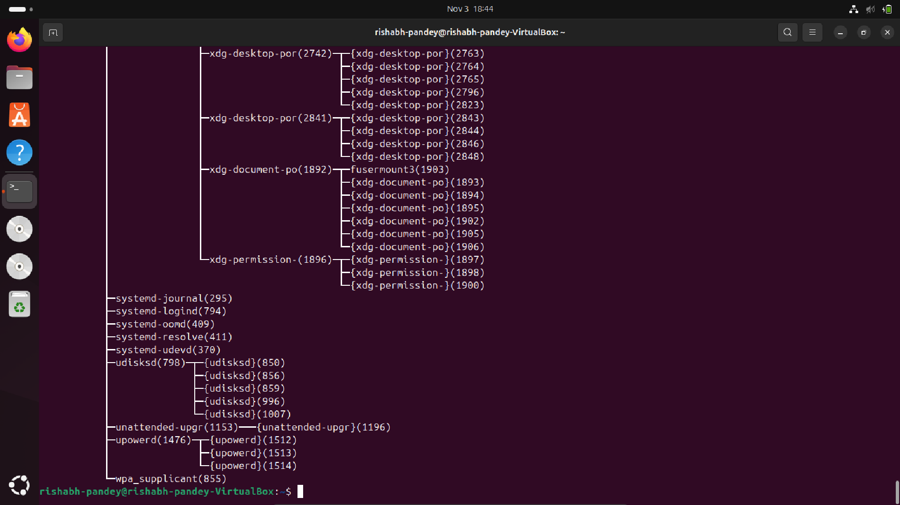
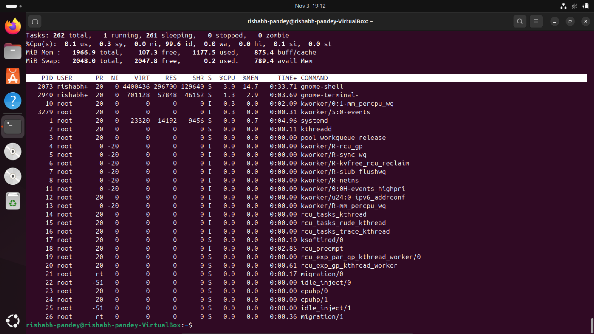
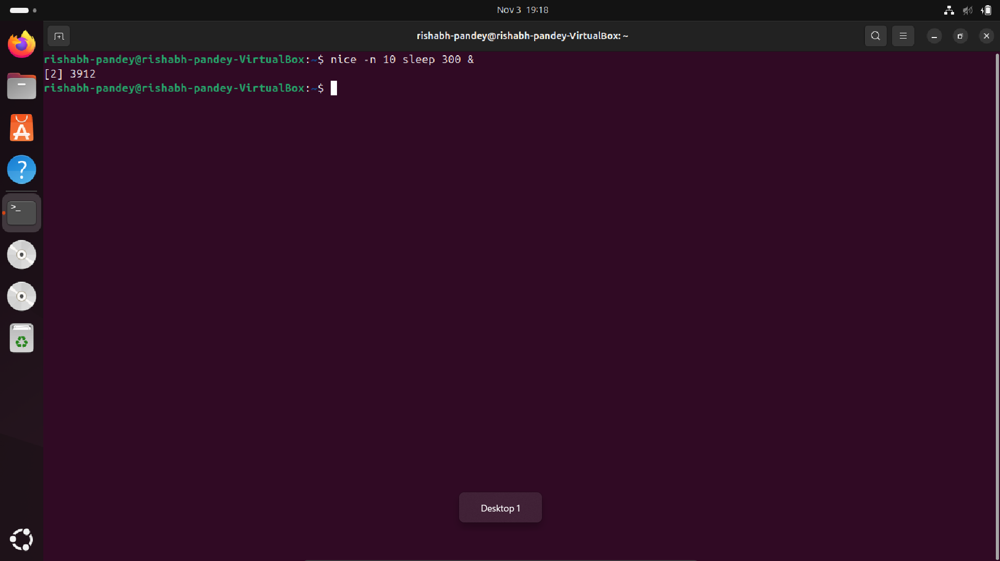
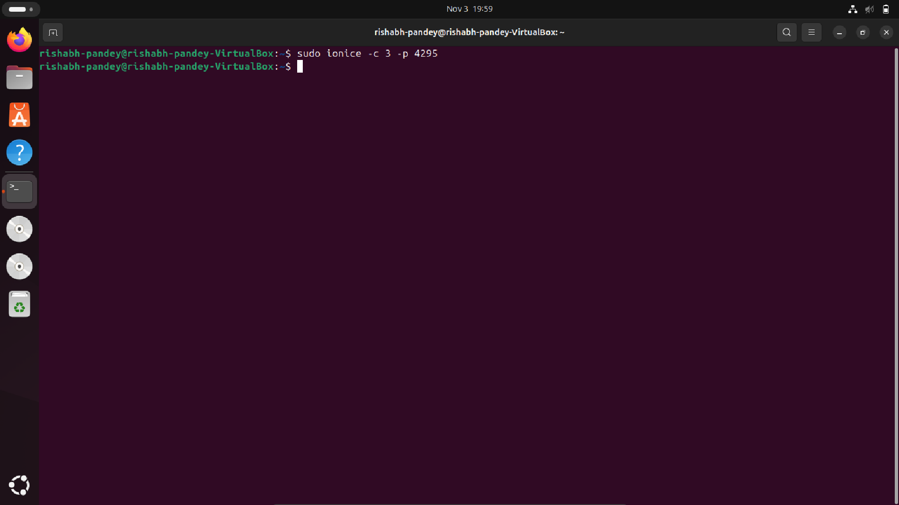
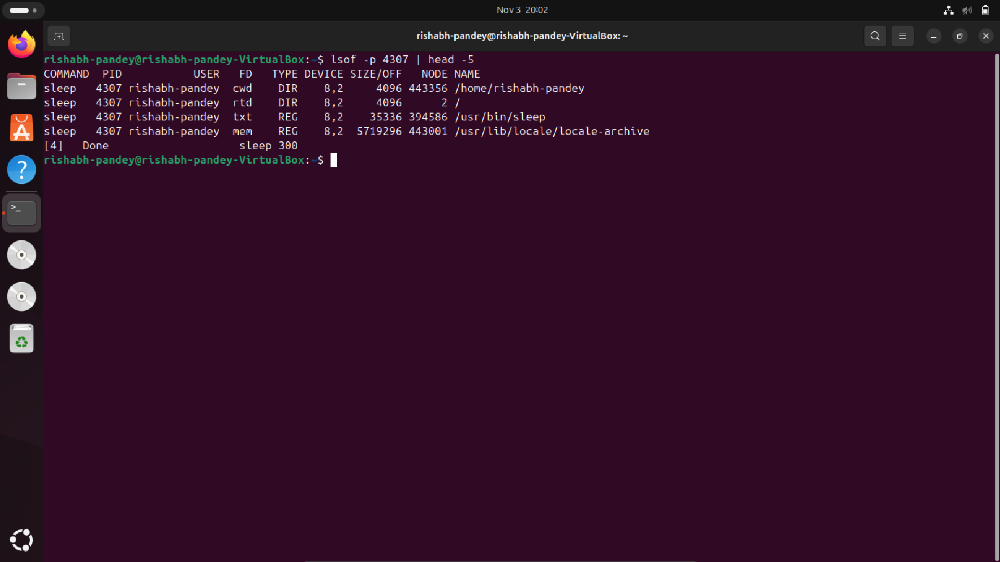
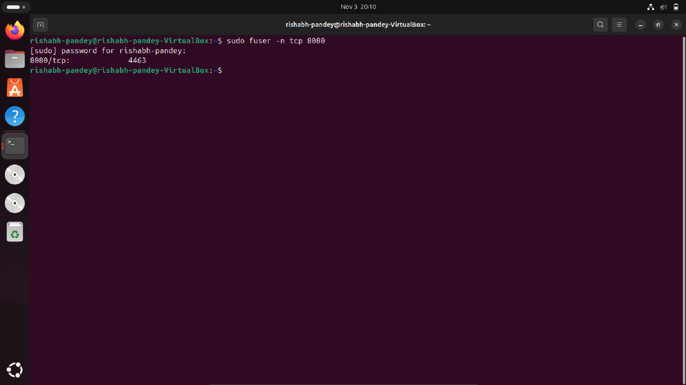
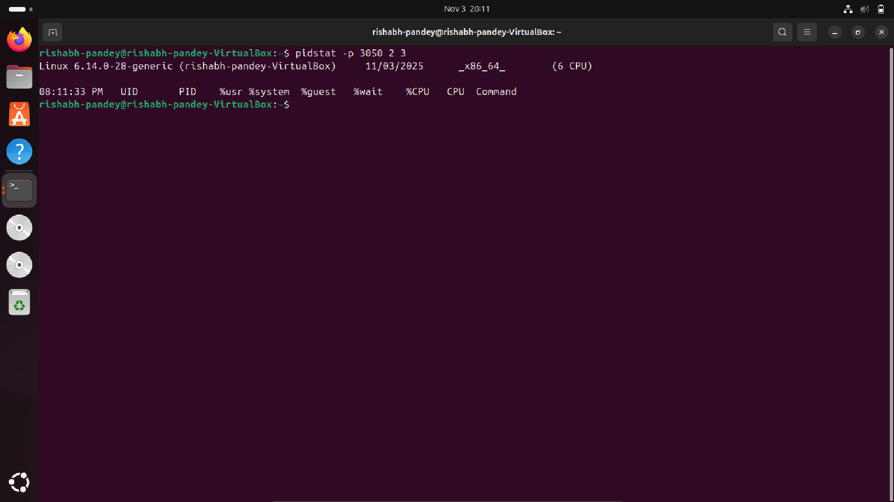
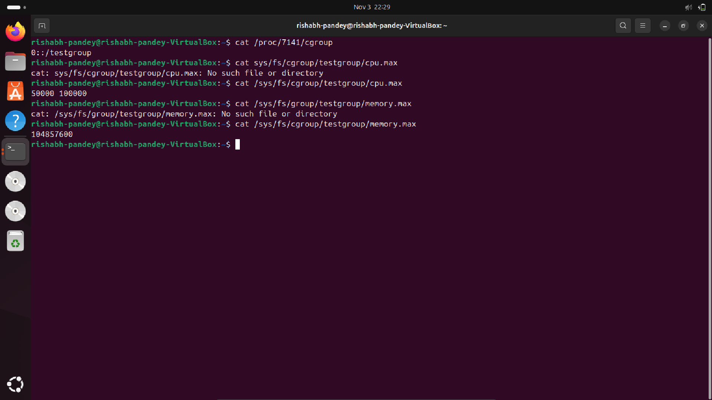

# 🧠 Linux Process Management — Technical Assignment  
*A Guided Exploration of How Linux Really Thinks*

---

## 🔹 1. Enumerating All Active Processes

### 🔧 Command

```bash
ps aux
````

### 🧩 Conceptual Insight

This classical invocation of `ps` provides a **snapshot of the entire process space**.

* `a` → Display processes of *all* users
* `u` → Include the effective user, CPU%, memory%, etc.
* `x` → Show processes detached from any controlling terminal

Together, they approximate a low-level “process census,” useful for diagnostic baselining.

### 📸 Output



---

## 🌲 2. Visualizing the Process Hierarchy

### 🔧 Command

```bash
pstree -p
```

### 🧩 Conceptual Insight

Processes in Linux are not a flat list; they form a **hierarchical tree** rooted in `systemd` (or historically, `init`).
`pstree` exposes these ancestry relations, making orphaned or runaway children immediately visible.

### 📸 Output


---

## 📊 3. Observing Real-Time System Dynamics

### 🔧 Command

```bash
top
```

### 🧩 Conceptual Insight

`top` acts as a **living cross-section** of process activity — updated continuously.
Use it to spot CPU hogs, memory leaks, or load spikes.
👉 Press `q` to exit before losing yourself in the numbers.

### 📸 Output


---

## ⚡ 4. Manipulating Process Scheduling Priority

### 🟢 Start a Process at Lower Priority

```bash
nice -n 10 sleep 300 &
```

👉 Here, the process (PID `3050` assumed) is launched with a *niceness* of `10`, signaling lower scheduling priority.

### 📸 Output


### 🔄 Reprioritize an Existing Process

```bash
renice -n -5 -p 3050
```

👉 Increasing priority (negative nice values) lets a process request more CPU attention — though it’s still subject to kernel policy constraints.

### 📸 Output


---

## 🔧 5. CPU Affinity — Binding a Process to Specific Cores

### 🔍 Inspect Current CPU Affinity

```bash
taskset -cp 3050
```

### 📸 Output


### 🎯 Bind the Process Strictly to Core 1

```bash
taskset -cp 1 3050
```

👉 Useful for performance isolation, cache locality experiments, or preventing contention.

### 📸 Output


---

## 📂 6. I/O Scheduling Priority

### 🔧 Command

```bash
ionice -c 3 -p 3050
```

👉 Class `3 (idle)` means the process performs disk I/O *only when the system is otherwise idle* — excellent for background jobs.

### 📸 Output


---

## 📑 7. Inspecting File Descriptors of a Process

### 🔧 Command

```bash
lsof -p 3050 | head -5
```

### 🧩 Conceptual Insight

A process is fundamentally defined by the **resources it holds**.
`lsof` reveals open files, sockets, pipes, and more — invaluable for debugging stuck I/O or memory-leaking daemons.

### 📸 Output



---

## 🐛 8. Tracing System Calls

### 🔧 Command

```bash
strace -p 3050
```

### 🧩 Conceptual Insight

This attaches a live syscall-level microscope to the process.
Perfect for reverse-engineering behavior, debugging failures, or understanding program–kernel interactions.

### 📸 Output


---

## 📡 9. Identifying Which Process Owns a Network Port

### 🔧 Command

```bash
sudo fuser -n tcp 8080
```

👉 If PID `4321` appears, that’s your port consumer — often helpful for debugging services, conflicts, or ghost processes.

### 📸 Output



---

## 📊 10. Per-Process Performance Statistics

### 🔧 Command

```bash
pidstat -p 3050 2 3
```

👉 Samples CPU/IO usage every **2 seconds**, repeating **3 times** — a lightweight profiler without full tracing overhead.



### 📸 Output

---

## 🔐 11. Resource Governance with Control Groups (cgroups)

### 🛠️ Create a Dedicated cgroup

```bash
sudo cgcreate -g cpu,memory:/testgroup
```

### 🚦 Apply Resource Limits

```bash
echo 50000 | sudo tee /sys/fs/cgroup/cpu/testgroup/cpu.cfs_quota_us
echo 100M   | sudo tee /sys/fs/cgroup/memory/testgroup/memory.limit_in_bytes
```

### ➕ Add PID 3050 to the Group

```bash
echo 3050 | sudo tee /sys/fs/cgroup/cpu/testgroup/cgroup.procs
```

👉 cgroups offer **fine-grained, kernel-enforced governance** — far beyond what `nice` can control.

### 📸 Output



---

## 🎯 12. Alternatives & Complements to `nice` / `renice`

### 1️⃣ Real-Time Scheduling — `chrt`

```bash
sudo chrt -f 50 sleep 1000
chrt -p <pid>
```

### 2️⃣ Disk I/O Prioritization — `ionice`

```bash
ionice -c 2 -n 7 tar -czf backup.tar.gz /home
```

### 3️⃣ CPU Affinity — `taskset`

```bash
taskset -c 1 firefox
```

### 4️⃣ cgroups for Granular Constraints

```bash
sudo cgcreate -g cpu,memory:/lowprio
echo 20000 | sudo tee /sys/fs/cgroup/cpu/lowprio/cpu.cfs_quota_us
echo 200M   | sudo tee /sys/fs/cgroup/memory/lowprio/memory.limit_in_bytes
echo 1234 | sudo tee /sys/fs/cgroup/cpu/lowprio/cgroup.procs
```

### 5️⃣ systemd-integrated Resource Control — `systemd-run`

```bash
systemd-run --scope -p CPUWeight=200 stress --cpu 4
```

### 6️⃣ Scheduling with `schedtool`

```bash
sudo schedtool -R -p 10 <pid>
```

---

## ✅ Consolidated Summary

| Tool          | Focus Area                       | Relation to `nice`          |
| ------------- | -------------------------------- | --------------------------- |
| `chrt`        | Real-time scheduling policies    | Alternative (stronger)      |
| `ionice`      | Disk I/O prioritization          | Complementary               |
| `taskset`     | CPU affinity                     | Complementary               |
| `cgroups`     | Kernel-level resource governance | Superset of capabilities    |
| `systemd-run` | systemd + cgroup orchestration   | Alternative + orchestration |
| `schedtool`   | Custom scheduling classes        | Alternative                 |

---
