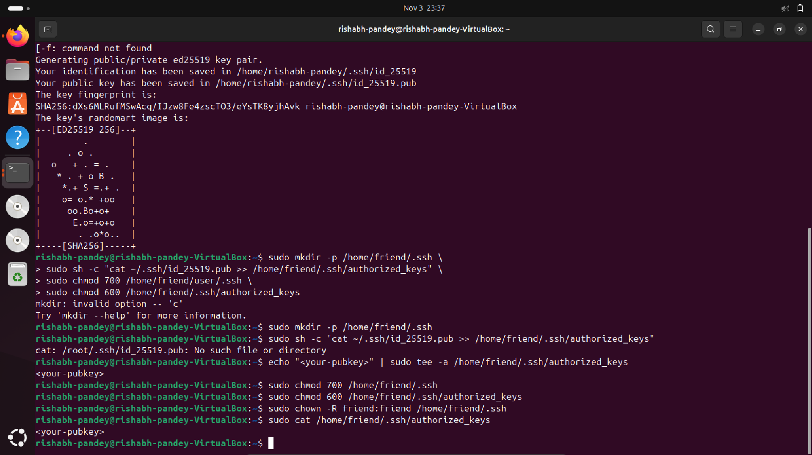
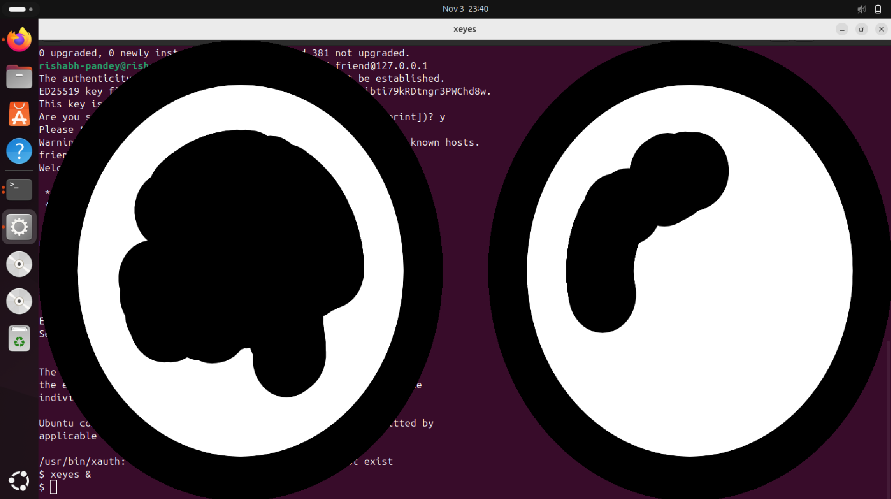

# ✅ Secure Remote GUI Access via SSH (X11) and VNC  
**OS Used:** Ubuntu (both systems)  
**Author:** Ryder  
**Course:** Linux System Administration  
**Assignment:** Remote GUI Access & Verification

---

## 📌 Objective
Demonstrate secure remote GUI access from your laptop to a remote machine (friend’s laptop) using:

1. **SSH with X11 Forwarding (Single GUI App)**  
2. **VNC Over SSH Tunnel (Full Desktop Session)**  

All operations assume explicit permission on the remote system.

---

# ✅ Step 1 — Prepare & Secure the Remote Machine  
*(Run these on the friend’s laptop)*

### ✅ 1. Install SSH and optional VNC server
```bash
sudo apt update
sudo apt install -y openssh-server tigervnc-standalone-server
````

### ✅ 2. Create non-root user & enable SSH service

```bash
sudo useradd -m frienduser || true
sudo passwd frienduser
sudo systemctl enable --now ssh
```

### ✅ 3. Configure SSH key-based authentication

Replace `<your-pubkey>` with your actual *public* SSH key:

```bash
sudo mkdir -p /home/frienduser/.ssh
echo "<your-pubkey>" | sudo tee -a /home/frienduser/.ssh/authorized_keys

sudo chmod 700 /home/frienduser/.ssh
sudo chmod 600 /home/frienduser/.ssh/authorized_keys
sudo chown -R frienduser:frienduser /home/frienduser/.ssh
```

---

## 📸 **Screenshot A: `authorized_keys` file**


---

# ✅ Step 2 — X11 Forwarding (Test GUI App Over SSH)

### ✅ 1. Connect using SSH + X11 forwarding

*(Run on your laptop)*

```bash
ssh -X frienduser@FRIEND_IP
```

### ✅ 2. Run a GUI app remotely

```bash
xeyes &
```

or

```bash
gedit &
```

✅ If successful: the GUI app appears on **your** laptop screen, though it runs on the friend’s machine.

---

## 📸 **Screenshot B: X11 Forwarding Result**

Should show:

* Terminal with `ssh -X frienduser@FRIEND_IP`
* GUI app (xeyes/gedit) open



---

# ✅ Step 3 — Full Desktop Access via VNC over SSH Tunnel

### ✅ 1. Start VNC server on remote machine

```bash
vncserver :1
```

This creates display `:1` → port **5901**

### ✅ 2. On your laptop, create secure SSH tunnel

```bash
ssh -L 5901:localhost:5901 frienduser@FRIEND_IP -N &
```

### ✅ 3. Connect using any VNC viewer

Open VNC client → connect to:

```
localhost:5901
```

✅ If successful: full desktop of remote machine appears.

---

## 📸 **Screenshot C: VNC Desktop Session**

**Place screenshot here:**


---

# ✅ Summary

This assignment demonstrates secure GUI remote access using:

* ✔ **SSH server setup with proper permissions**
* ✔ **Public-key authentication**
* ✔ **X11 forwarding to run GUI apps remotely**
* ✔ **VNC over SSH for a full remote desktop**
* ✔ **Verification screenshots for each stage**

All actions follow secure, permission-based remote access practices.

---

# ✅ End of Submission ✅


